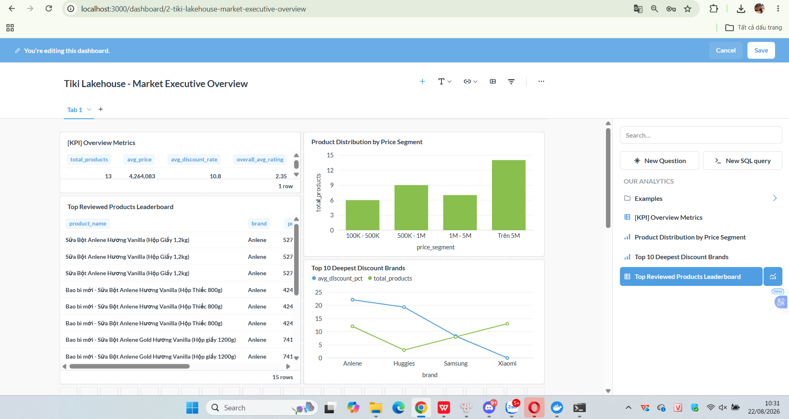

# Tiki E-Commerce Data Lakehouse Pipeline

Pipeline thu thập, chuẩn hóa và mô hình hóa dữ liệu thương mại điện tử từ API của Tiki.vn, xây dựng theo kiến trúc Medallion (Bronze → Silver → Gold). Dữ liệu sau khi qua các lớp được nạp vào PostgreSQL và visualize bằng Metabase.

Stack: MinIO, PySpark, Delta Lake, PostgreSQL, Airflow, Metabase — chạy hoàn toàn qua Docker Compose.

## Kiến trúc

```
Tiki.vn API
    │  scrape JSON
    ▼
MinIO (Bronze) ── raw JSON, partition theo crawl_date
    │  PySpark + Delta Lake: validate schema, dedup, MERGE INTO
    ▼
MinIO (Silver) ── Delta table đã clean (categories, products, reviews)
    │  PySpark: build star schema
    ▼
PostgreSQL (Gold) ── dim/fact tables
    │
    ▼
Metabase ── dashboard
```

Toàn bộ 3 bước Bronze → Silver → Gold được Airflow điều phối chạy hằng ngày qua 1 DAG.

## Vì sao chọn stack này

- **MinIO** thay vì HDFS vì setup local nhẹ hơn nhiều, vẫn tương thích S3 API nên code Spark không phải sửa gì khi đổi sang S3 thật sau này.
- **Delta Lake** để có ACID transaction và `MERGE INTO`, tránh phải viết logic upsert thủ công mỗi lần crawl lại dữ liệu trùng.
- **Airflow** để tự động hóa lịch chạy, retry khi fail, và dễ theo dõi log từng task thay vì chạy tay từng script.
- **Metabase** vì nhẹ, setup nhanh, đủ dùng cho báo cáo nội bộ, không cần BI tool nặng như Superset hay Power BI.

## Cấu trúc thư mục

```
tiki-lakehouse-pipeline/
├── dags/
│   └── tiki_lakehouse_pipeline_dag.py   # DAG orchestrate Bronze -> Silver -> Gold
├── dashboards/
│   └── dashboard_overview.png            # ảnh chụp dashboard Metabase
├── src/
│   ├── extract/
│   │   ├── minio_client.py               # helper connect MinIO/S3 qua boto3
│   │   └── tiki_scraper.py               # scraper API Tiki (category, product, review)
│   └── transform/
│       ├── spark_session_helper.py       # config SparkSession + Delta & S3A jars
│       ├── silver_transform.py           # Bronze -> Silver
│       ├── gold_transform.py             # Silver -> Gold (star schema, ghi Postgres)
│       ├── peek_silver.py                # xem nhanh data Silver
│       └── peek_gold.py                  # xem nhanh data Gold
├── Dockerfile                            # image Airflow custom, có Java 17 + PySpark
├── docker-compose.yml
├── requirements.txt
└── README.md
```

## Cài đặt

Yêu cầu: Docker Desktop, tối thiểu 4GB RAM cấp cho Docker.

```bash
git clone https://github.com/<your-username>/tiki-lakehouse-pipeline.git
cd tiki-lakehouse-pipeline

docker compose build --no-cache
docker compose up -d
```

Các service sau khi lên:

| Service | URL | Login |
|---|---|---|
| Airflow | http://localhost:8080 | admin / admin |
| MinIO Console | http://localhost:9001 | admin / password123 |
| Metabase | http://localhost:3000 | tự tạo account lần đầu |
| PostgreSQL | localhost:5432 | airflow / airflow_password, db: airflow_db |

## Chạy pipeline

**Cách 1 — qua Airflow (khuyến nghị):**

Vào Airflow UI, unpause DAG `tiki_lakehouse_daily_pipeline`, trigger chạy tay hoặc để tự chạy theo lịch hằng ngày. DAG gồm 3 task nối tiếp: `scrape_tiki_to_bronze` → `bronze_to_silver_delta` → `silver_to_gold_postgres`.

**Cách 2 — chạy tay từng bước qua CLI:**

Ingest vào Bronze:
```bash
docker exec -it lakehouse_airflow python /opt/airflow/src/extract/tiki_scraper.py
```
Ghi ra `s3://lakehouse/bronze/{entity}/crawl_date=YYYY-MM-DD/`

Clean + merge vào Silver:
```bash
docker exec -it lakehouse_airflow python /opt/airflow/src/transform/silver_transform.py
```
Ghi ra `s3://lakehouse/silver/{categories|products|reviews}/`. Xem lại data:
```bash
docker exec -it lakehouse_airflow python /opt/airflow/src/transform/peek_silver.py
```

Build star schema vào Gold:
```bash
docker exec -it lakehouse_airflow python /opt/airflow/src/transform/gold_transform.py
```
Xem lại bảng trong Postgres:
```bash
docker exec -it lakehouse_airflow python /opt/airflow/src/transform/peek_gold.py
```

## Schema lớp Gold

**Dimension**
- `dim_categories`: category_id (PK), category_name, url
- `dim_products`: product_id (PK), product_name, brand, short_description, image_url

**Fact**
- `fact_daily_product_snapshot`: snapshot_date, product_id (FK), price, original_price, discount, discount_rate, rating_average, review_count, inventory_status, price_segment
- `fact_reviews`: review_id (PK), product_id (FK), rating, title, content, thank_count, comment_count, created_at

## Dashboard

Metabase connect thẳng vào Postgres (lớp Gold), gồm:

- Tổng quan số lượng sản phẩm, giá trung bình, mức giảm giá trung bình, rating trung bình.
- Phân bố sản phẩm theo phân khúc giá (dưới 100K, 500K–1M, trên 5M...).
- Top brand giảm giá sâu nhất.
- Sản phẩm được review nhiều nhất / rating cao nhất.

Ảnh chụp dashboard: 
